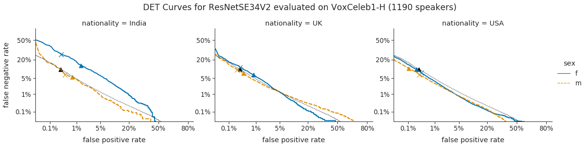
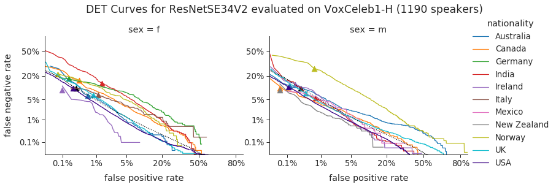

=======
Example
=======

Below is an example for using bt4vt. All code and data for reproducing the example are contained in the [example](example) directory.
The example evaluates the fairness of models released with the `VoxCeleb Trainer <https://github.com/clovaai/voxceleb_trainer>`_ benchmark.

Evaluate speaker verification performance across subgroups
__________________________________________________________

1. Generate speaker verification results with metadata
^^^^^^^^^^^^^^^^^^^^^^^^^^^^^^^^^^^^^^^^^^^^^^^^^^^^^^

For convenience, we have included a `voxceleb` module for generating the appropriate input dataframe for SVEva Fair from the VoxCeleb Trainer results and metadata. The results can be reproduced with the code and models made available by voxceleb trainer.
For evaluation we use scores for the speaker pairs from the `H` test set::

    import sveva_fair.voxceleb as sveva_vox

    score_file = 'example/resnetse34v2_H/eval_scores.csv'
    meta_file = 'example/vox1_meta.csv'
    df = sveva_vox.voxceleb_scores_with_demographics(score_file, meta_file, sep='\t')
    df.rename(columns={"ref_gender": "sex", "ref_nationality":"nationality"}, inplace=True)

2. Evaluate the results
^^^^^^^^^^^^^^^^^^^^^^^

The evaluation functions return false negative rates (FNR), false positive rates (FPR) and the corresponding threshold values for speaker verification scores stored in dataset `df`. `df` must have a column with scores `df['sc']` and a column with labels `df['lab']`. The `sg_` function determines these values for subgroups that are specified in a list of column names passed to the filter_keys argument.::

    all_fpfnth, all_metrics = sveva_evaluate.fpfnth_metrics(df)
    sg_fpfnth, sg_metrics = sveva_evaluate.sg_fpfnth_metrics(df, filter_keys=['nationality','sex'])

In addition to the FPR, FNR and threshold values, the functions also return a dictionary with metrics: `min_cdet`, the minimum of the detection cost function, and `eer`, the equal error rate. The following optional arguments can be passed to the evaluation functions to adjust the detection cost to the application requirements::

    dcf_p_target [float]: detection cost function target (default = 0.05)
    dcf_c_fn [float]: detection cost function false negative weight (default = 1)
    dcf_c_fp [float]: detection cost function  false positive weight (default = 1)

3. Plot Detection Error Trade-off curves
^^^^^^^^^^^^^^^^^^^^^^^^^^^^^^^^^^^^^^^^

For plotting use::

    g = sveva_plot.plot_det_curves(sg_fpfnth, hue='sex', style='sex', col='nationality')
    g = sveva_plot.plot_det_baseline(g, all_fpfnth, all_metrics, threshold_type='min_cdet_threshold')
    g = sveva_plot.plot_thresholds(g, sg_fpfnth, sg_metrics, threshold_type='min_cdet_threshold', metrics_baseline=all_metrics)

or::

    g = sveva_plot.plot_det_curves(sg_fpfnth, hue='nationality', col='sex', linewidth=1.25, palette=cc.glasbey_category10[:len(sg_fpfnth['nationality'].unique())])
    g = sveva_plot.plot_det_baseline(g, all_fpfnth, all_metrics, 'min_cdet_threshold')
    g = sveva_plot.plot_thresholds(g, all_fpfnth, all_metrics, 'min_cdet_threshold', min_threshold=['overall'], metrics_baseline=all_metrics)

